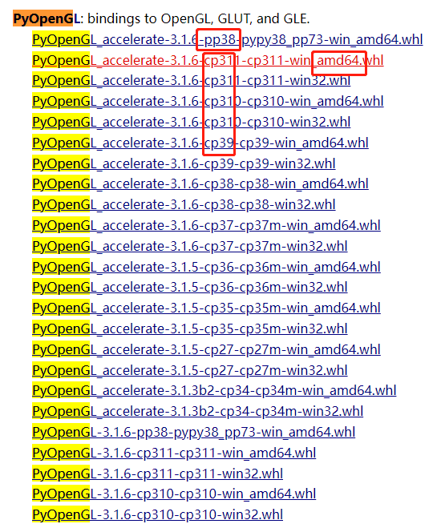
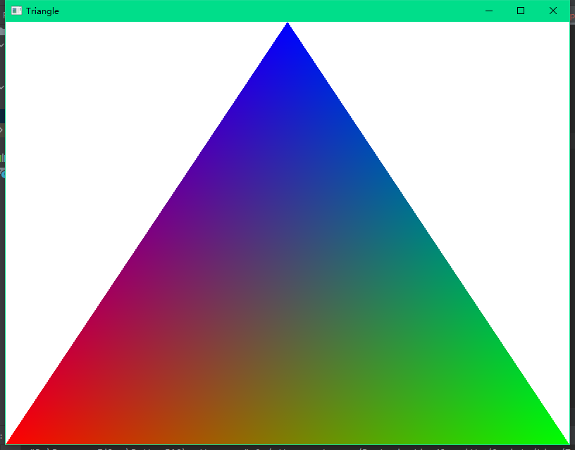

下载地址

https://www.lfd.uci.edu/~gohlke/pythonlibs/#pyopengl



图中的cp3XX指的是python 3.XX的意思，amd64对应的是64位系统！

下载对应的版本的wheel后，

```python
pip install ./XXXXXXXX.whl
```

进行安装就可以了！

需要安装`PyOpenGL_accelerate`和`PyOpenGL`

测试结果:



测试用的代码！

```python

from OpenGL.GL import *
from OpenGL.GLU import *
from OpenGL.GLUT import *
 
def init():
    glClearColor(1,1,1,1)
    gluOrtho2D(-1,1,-1,1)
 
def triangle():
    glClear(GL_COLOR_BUFFER_BIT)
    glColor3f(1,0,0)
    glBegin(GL_TRIANGLES)
 
    glColor3f(1,0,0)
    glVertex2f(-1, -1)
    
    glColor3f(0,1,0)
    glVertex2f(1, -1)
    
    glColor3f(0,0,1)
    glVertex2f(0, 1)
    
    glEnd()
    glFlush()
 
def main():
    glutInit(sys.argv)
    glutInitDisplayMode(GLUT_SINGLE | GLUT_RGB)
    glutInitWindowSize(800,600)
    glutInitWindowPosition(50,50)
    glutCreateWindow(b"Triangle")
    glutDisplayFunc(triangle)
    init()
    glutMainLoop()
 
if __name__ == '__main__':
    main()
```